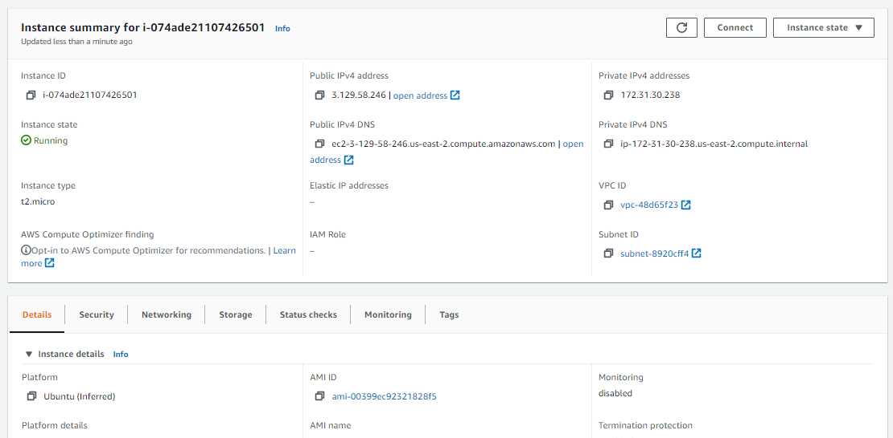
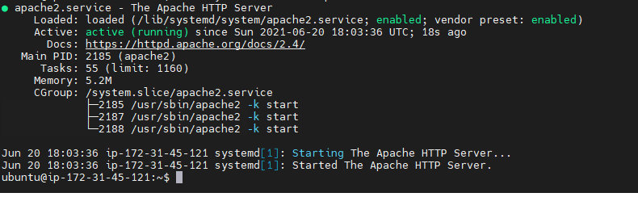
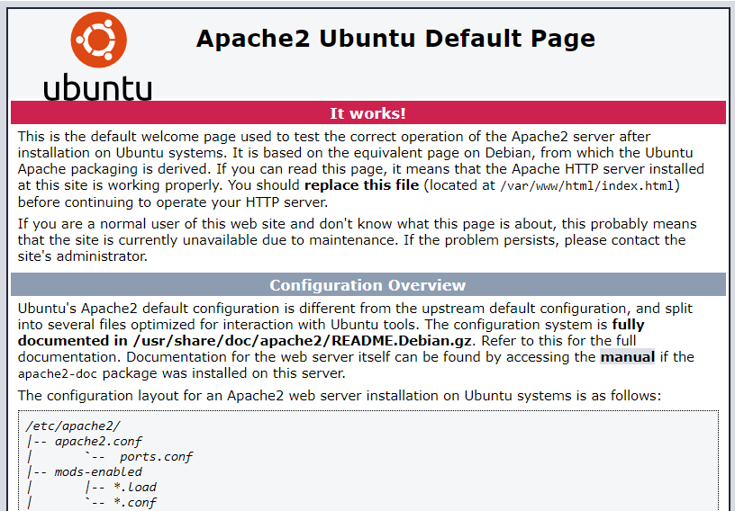
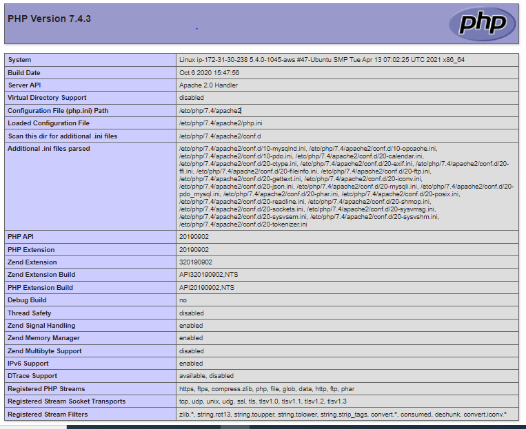

# WEB STACK IMPLEMENTATION (LAMP)
 
1. Create an EC2 t2 micro instance running ubuntu. 

2. Established SSH connection using Putty. Enabled port 80 in the inbound firewall rules in the security settings of the EC2 instance. 
3. Install and configured apache web server. 

4. Install and configure MySQL. 
5. Install and configure PHP. Browsed to http://3.129.58.246/ from the local machine to then see the PHP status information page.

5. Enable PHP on the website.

 

__Credit to:__

[Darey.io](https://darey.io)
